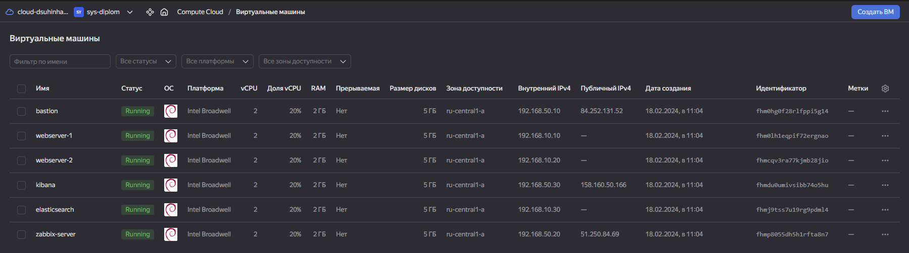

#  Дипломная работа по профессии «Системный администратор» SYS-19 Сухин Даниил  

## Задача
Ключевая задача — разработать отказоустойчивую инфраструктуру для сайта, включающую мониторинг, сбор логов и резервное копирование основных данных. Инфраструктура должна размещаться в [Yandex Cloud](https://cloud.yandex.com/) и отвечать минимальным стандартам безопасности: запрещается выкладывать токен от облака в git. Используйте [инструкцию](https://cloud.yandex.ru/docs/tutorials/infrastructure-management/terraform-quickstart#get-credentials).  

[Полное задание к дипломной работе:](https://github.com/netology-code/sys-diplom/tree/diplom-zabbix)  
---

# Подготовка к развёртке инфраструктуры

- скачивание последней версии Terraform из [зеркала](https://hashicorp-releases.yandexcloud.net/terraform/) Яндекс.
```
wget https://hashicorp-releases.yandexcloud.net/terraform/1.7.3/terraform_1.7.3_linux_amd64.zip
```
- распковка архива
```
zcat terraform_1.7.3_linux_amd64.zip > terraform
```
- выдача прав на запуск
```
chmod 766 terraform
```
- проверка работоспособности
```
./terraform -v
```
- создание файла конфигурации и выдача прав
```
nano ~/.terraformrc
chmod 644 .terraformrc
```
- вносим данные, указанные в [документации](https://cloud.yandex.ru/ru/docs/tutorials/infrastructure-management/terraform-quickstart#get-credentials)
```
provider_installation {
  network_mirror {
    url = "https://terraform-mirror.yandexcloud.net/"
    include = ["registry.terraform.io/*/*"]
  }
  direct {
    exclude = ["registry.terraform.io/*/*"]
  }
}
```
- в папке, в которой будет запускаться Terraform, нужно создать файл ```main.tf``` с следующим содежанием
```
terraform {
  required_providers {
    yandex = {
      source = "yandex-cloud/yandex"
    }
  }
  required_version = ">= 0.13"
}

# Описание доступа и токена
provider "yandex" {
  token     = "OAuth-токен"
  cloud_id  = "ID облака"
  folder_id = "ID папки"
}
```
- там же, создать файл ```meta.yaml```
```
#cloud-config
 users:
  - name: user
    groups: sudo
    shell: /bin/bash
    sudo: ['ALL=(ALL) NOPASSWD:ALL']
    ssh-authorized-keys:
     - ssh-rsa **********
```
- генерация ключа ssh
```
ssh-keygen
```
- скопировать содержимое ключа ssh-rsa в файл ```meta.yaml```
```
cat ~/.ssh/id_rsa.pub
```
- инициализация Terraform
```
./terraform init
```


---

## Разветка Terraform
После подготовки остальных ```.tf``` конфигов можно начинать развертку из папки Terraform.

- запуск развертки
```
./terraform apply
```
- получаем список IP-адресов (файл ```ansible_inventory.tf``` копирует адреса в файл ```/ansibe/hosts.ini```)


Проверка результата в Yandex Cloud:
- одна сеть bastion-network
- две подсети bastion-internal-segment и bastion-external-segment
- Балансировщик alb-lb с роутером web-servers-router, целевой группой tg-web


- 6 виртуальных машин



- 10 групп безопасности


- ежедневные снимки дисков по расписанию


---

## Развертка Ansible
Первым делом, нужно установить Ansible, однако с его установкой и запуском есть рад не очевидных нюансов.
В данном проекте я использовал не только ```roles``` но ```collections```, однако если на Debian 11 использовать команду
```
apt install ansible
```
тогда он подтянет старую версию ```10.0.0```. Для использования ```collections``` нужно иметь версию не менее ```11.0.0```.
Так что, я рекомендую внимательно смотреть на версию Ansbile и версии ```collections``` и ```roles``` что бы они были совместимы. Более подробно это описано в официальной [документации](https://docs.ansible.com/ansible/latest/installation_guide/intro_installation.html) Ansible.
